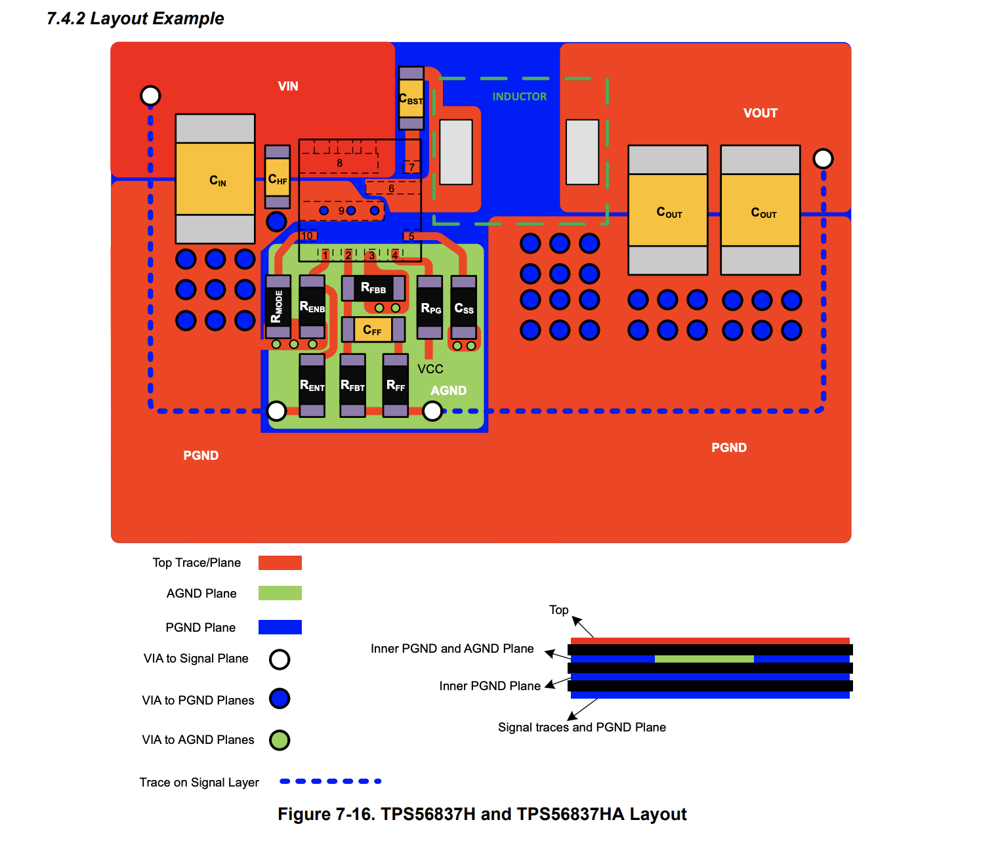
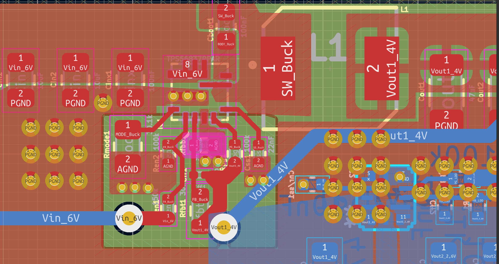
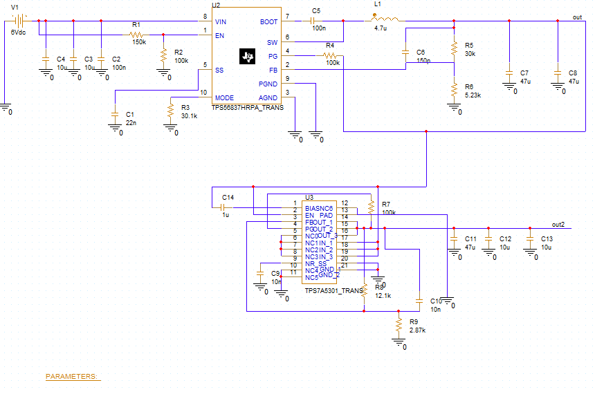
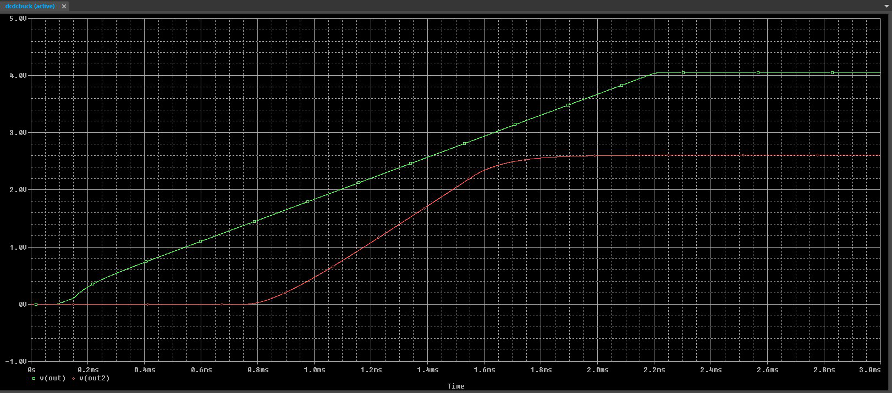
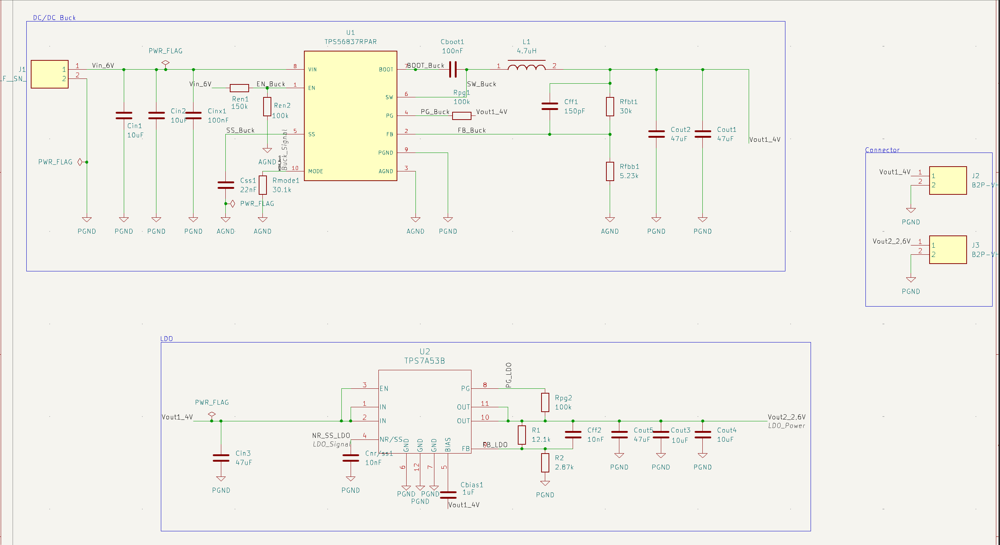
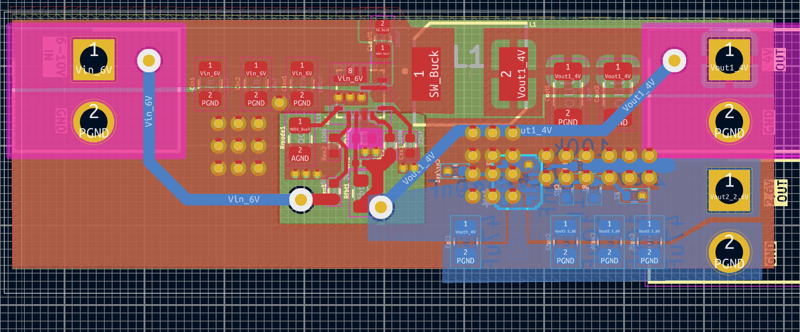
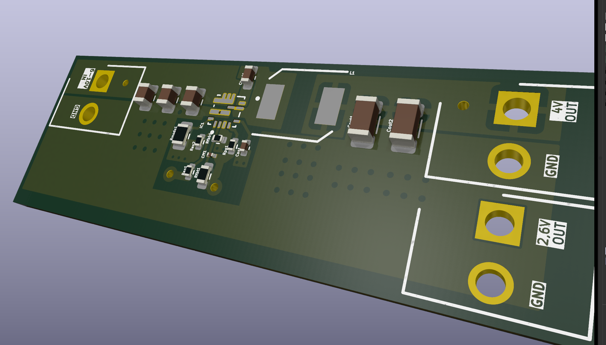

# ⚡ Dual-Stage Power Supply (DC-DC Buck + LDO)

**Input:** 6–10V DC  
**Output 1:** 4V @ 3.5A (Buck Converter)  
**Output 2:** 2.6V @ 1.7A (LDO Regulator)  
**Design Tool:** KiCad  
**ICs:** TPS56837H (Buck), TPS7A53B (LDO)

---

## 🧩 Description

This is a compact, efficient two-stage power supply designed for low-noise and high-current applications. It converts a 6–10V DC input into:

- 4V @ 3.5A via DC-DC Buck (TPS56837H)
- 2.6V @ 1.7A via LDO (TPS7A53B)

The design was based on official **Texas Instruments datasheets**, simulation tools, and PCB manufacturer guidelines. Great care was taken in layout, thermal management, and ground isolation.

---

## 🔧 Key Components

| Stage | IC           | Vin         | Vout | Iout Max | Notes                        |
|-------|--------------|-------------|------|----------|------------------------------|
| Buck  | TPS56837H    | 6–10 V      | 4 V  | 3.5 A    | Synchronous, 500 kHz         |
| LDO   | TPS7A53B     | 4 V         | 2.6 V| 1.7 A    | Ultra-low noise, high PSRR   |

---

## 📐 Layout Design vs TI Recommendation

This PCB layout was designed by following layout principles from the **TPS56837H datasheet**.

<table>
  <tr>
    <td><b>TI Recommended Layout</b> </td>
    <td><b>My PCB Layout (KiCad)</b> </td>
  </tr>
</table>

🛠️ **Matched Design Features:**
- Short loops for high-current paths (Cin → SW → Inductor → Cout)
- Correct placement of decoupling capacitors near IC pins
- AGND and PGND separation via internal planes and via stitching
- Wide copper traces sized according to 3.5A requirement
- Respect of layout zones for analog feedback and control

---
---

## 🧪 PSpice Simulation

The design was simulated in PSpice using vendor-provided models for both the buck converter (TPS56837H) and LDO (TPS7A5301).  
This helped verify soft-start behavior, regulation stability, and output timing before fabrication.

<table>
  <tr>
    <td><b>Schematic (PSpice)</b> </td>
    <td><b>Simulation Result</b> </td>
  </tr>
</table>

Green = Vout1 (4 V)  
Red = Vout2 (2.6 V)

The simulation shows proper soft-start ramp-up and sequential regulation, matching expectations.
Simulation files are aviable on my [Google Drive](https://drive.google.com/drive/folders/1zhOBsbE7j7mKasGqCcKV4JfBKCOTLMK9?hl=cs)_

## 🖼️ Images

### Schematic  

### PCB Layout (Top Layer)  

### 3D View  

---

## ⚠️ Design Challenges & Fixes

### ⚠️ LDO BIAS Pin Not Connected

In the first revision, the **BIAS pin** of the LDO (TPS7A53B) was left floating.  
According to [section 8.3.1.2 of the datasheet](https://www.ti.com/lit/ds/symlink/tps7a53b.pdf#page=19), this causes the output to **follow the input voltage** instead of regulating — which is exactly what happened.

📌 **Fix:** Connected BIAS to VIN (4 V) and added a 1 µF capacitor to GND, as recommended in the datasheet.

---

### ⚠️ Incorrect EN Pin Logic on Buck Converter

Initially, the **EN pin** of the buck converter was connected to its own output (VOUT), assuming it would enable itself after power-up.  
However, this caused the converter to stay disabled at startup.

📌 **Fix:** Connected EN to VIN through a **resistor divider**, ensuring a valid logic-high signal at startup. This resolved the issue and allowed proper converter initialization.

---

### ⚠️ TI-Provided Footprint Had Pad Issues

The **footprint from TI's UltraLibrarian export** for the TPS7A53B had issues:
- Some **pads were incorrectly shaped or numbered**
- **Routing was blocked** due to KiCad DRC violations

📌 **Fix:** Manually edited the footprint in **KiCad Footprint Editor** to:
- Adjust pad shapes and positions
- Fix pin numbering
- Ensure proper copper connection and DRC clearance

---

These issues were identified during layout review and early testing, and fixed in preparation for the next board revision.

---

## 📁 Project Files

- `/schematic/` — KiCad schematic (`.kicad_sch`)  
- `/pcb/` — KiCad board layout (`.kicad_pcb`)  
- `/gerbers/` — Gerber files for fabrication  
- `/bom/` — Bill of Materials  
- `/pdf/` — PDF exports of schematic and layout

---

## 🧮 Tools & Calculators Used

- [TI Webench Power Designer](https://webench.ti.com/power-designer/)
- [ChipDip Voltage Divider Calculator](https://www.chipdip.ru/calc/voltage-divider)
- [Trace Width Calculator (AdvancedPCB)](https://www.advancedpcb.com/en-us/tools/trace-width-calculator/)
- [Via Properties Calculator (911EDA)](https://www.911eda.com/pcb-design-calculators/via-properties-calculator/)
- [JLCPCB Capabilities](https://jlcpcb.com/capabilities/pcb-capabilities)

---

## ✅ Project Status

- [x] Schematic complete  
- [x] PCB layout finished  
- [x] BOM generated  
- [x] Layout verified vs datasheet  
- [ ] PCB ordered  
- [ ] Load testing  
- [ ] Ripple and thermal validation

---

## 📚 References

- [TPS56837H Datasheet](https://www.ti.com/product/TPS56837H)
- [TPS7A53B Datasheet](https://www.ti.com/product/TPS7A53B)
- [KiCad Docs](https://docs.kicad.org/)

---

> 💬 Suggestions, improvements, or critiques are welcome. This design is still open for review.
